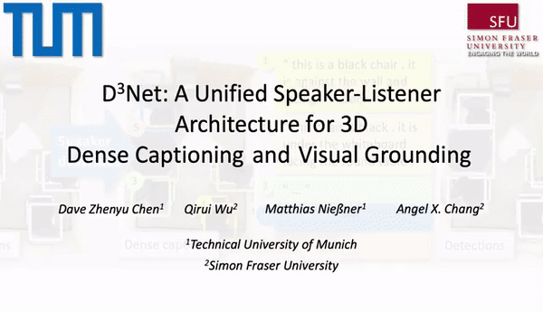

# D3Net: A Speaker-Listener Architecture for Semi-supervised Dense Captioning and Visual Grounding in RGB-D Scans

## Introduction

Recent studies on dense captioning and visual grounding in 3D have achieved impressive results. Despite developments in both areas, the limited amount of available 3D vision-language data causes overfitting issues for 3D visual grounding and 3D dense captioning methods. Also, how to discriminatively describe objects in complex 3D environments is not fully studied yet. To address these challenges, we present D3Net, an end-to-end neural speaker-listener architecture that can detect, describe and discriminate. Our D3Net unifies dense captioning and visual grounding in 3D in a self-critical manner. This self-critical property of D3Net also introduces discriminability during object caption generation and enables semi-supervised training on ScanNet data with partially annotated descriptions. Our method outperforms SOTA methods in both tasks on the ScanRefer dataset, surpassing the SOTA 3D dense captioning method by a significant margin (23.56% CiDEr<!-- -->@<!-- -->0.5IoU improvement).

Please also check out the project website [here](https://daveredrum.github.io/D3Net/index.html).

For additional detail, please see the D3Net paper:  
"[D3Net: A Speaker-Listener Architecture for Semi-supervised Dense Captioning and Visual Grounding in RGB-D Scans](https://arxiv.org/abs/2012.02206)"  
by [Dave Zhenyu Chen](https://daveredrum.github.io/), [Qirui Wu](), [Matthias Nießner](https://www.niessnerlab.org/members/matthias_niessner/profile.html) and [Angel X. Chang](https://angelxuanchang.github.io/)  
from [Technical University of Munich](https://www.tum.de/en/) and [Simon Fraser University](https://www.sfu.ca/).

## Coming Soon!